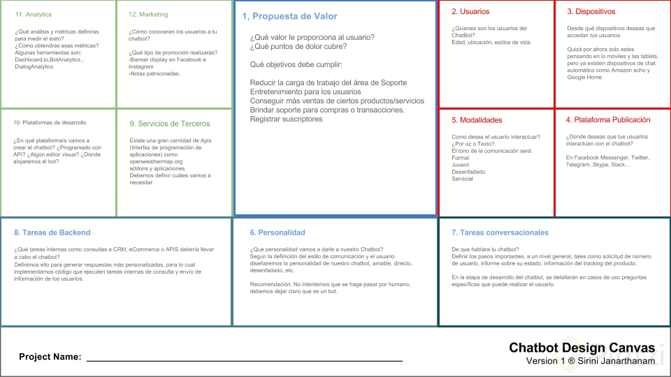

# Facebook Messeger

Es un programa que recibe e interpreta mensage de los usuarios a traves de la aplicación de chat de facebook

## ¿Qúe podemos hacer con un bot?

Las posibilidades son infinitas, algunos ejemplos podrían ser:

* Informarte sobre el clima o cambios de divisa
* Preguntar sobre el trafico actual 
* Ver las últimas noticias
* Ver descuentos de nuestras tiendas favoritas
* Reservas en un restaurante
* Brindar servicio al cliente

## ¿Que es ChatBot Design Canvas?

Chatbot Design Canvas es una herramienta que podemos utilizar para el diseño de un chatbot. Este lienzo está ordenado por colores, el azul para la propuesta de valor, el rojo todos los parámetros relacionados con el usuario, el turquesa para todos los parámetros de diseño de chatbot y el verde para todos los parámetros de desarrollo e implementación de chatbot y los cuales están divididos en 12 elementos que nos ayudarán a darle propósito, y mejorar la construcción de nuestro bot, esta herramienta no es exclusivamente para messenger, la puedes utilizar para planear cualquier bot que interactúe con un usuario final sin importar la plataforma donde se desplegara (Messenger, Slack, Twitter, etc.).

### Propuesta de Valor
Debemos definir lo más importante para nuestro chatbot que problemas o necesidades está resolviendo a nuestros clientes o usuarios.

* ¿Qué valor le proporciona al usuario?
* ¿Qué puntos de dolor cubre?

### Usuarios
¿Quienes serán los usuarios de nuestro chatbot? Tenemos que cuestionarnos sobre la edad, su ubicación, gustos, estilo de vida, y sin olvidar un factor importante su idioma. Entender bien quienes serán los que consumirán nuestro chatbot garantizara su éxito.

### Dispositivos
Desde donde vivirá tu chatbot, desde un aplicación móvil, desde un sitio web, una integración en tu página web o en un futuro no lejano integrarlo a Amazon Alexa o Siri o Google Home.

### Plataformas de despliegue
Donde vivirá tu chatbot, Hay muchas herramientas que te permiten crear un bot y añadirlo a Facebook Messenger, Twitter, Slack, Telegram, Twitter, elegir la mejor opción será también la clave para llegar a más usuarios.

### Modalidades
Cómo será tu chatbot, formal, juvenil, servicial, desenfadado, como interactuar con el usuario, por texto, imagen, audio. Es importante elegir una modalidad para poder enfocar la construcción de la conversación que tendrá cara a los usuarios.

### Personalidad
Una consideración que deben tener es no hacer pasar por humano a nuestro chatbot, es mejor hacerle ver al usuario que está interactuando con un bot y las limitantes que tiene para atenderlo. Una vez elegida una modalidad la personalidad la convención que le daremos a todo el flujo de nuestro chatbot.

### Tareas conversacionales
En este punto debemos establecer los pasos importantes, las acciones principales que cumplirá y que serán parte esencial del flujo.

### Tareas de desarrollo
Qué herramientas vamos a integrar, que servicios de terceros utilizamos, Mapas, Apis de consumo, almacenamiento y todas aquellas tareas que impliquen necesitar un servicio de terceros ajeno a nuestro desarrollo.

### Servicios de terceros
Una vez establecidas las tareas vamos a elegir los servicios que usaremos o contrataremos para integrarlos en nuestro chatbot

### Plataforma de desarrollo del chatbot
Cuales serán nuestras herramientas, que vamos a utilizar, donde se hospedara el servicio, qué recursos necesitaremos y todo lo que implique su construcción.

### Estadísticas
La información que vamos a recopilar y que será parte fundamental para tomar decisiones importantes sobre el flujo que tendrá en un futuro o si el objetivo principal se está cumpliendo.

### Promoción
Como vamos a promover nuestro servicio, cuál será la estrategia que vamos a tomar para llegar a nuestros usuarios y que estos interactúen con nuestro bot conversaciones.

## Fan Page Facbook
Lo primero es asegurarnos de tener una Fan Page Facebook donde vivira nuestro bot

## Registrarte como desarrollador de facebook
Para esto puedes visitar el siguiente link
<a href="developers.facebook.com" rel="some text">Click aquí</a>

## Webhook
Un Webhook es una manera de ser notificado cuando un evento ha ocurrido en tu aplicacion o la de un tercero. Es básicamente una solicitud POST que se envía a una URL específica. Esa URL está configurada para recibir el cuerpo de la solicitud POST y procesarla de alguna manera.

## Ngrok
Ngrok es una herramienta que nos permite exponer nuestro servidor local a internet demanera segura, es decir, crea un tunel sobre nuestro servidor local con una salida publica a internet, esto lo utilizaremos para que facebook pueda tener acceso a nuestro servidor mientras estamos desarrollando nuestro bot.

Ngrok nos permitira usar dos tipos de tunel con http y https, para neustra aplicación facebook nos pedirá que usemos de tipo htpps.

by @Oscar Barajas Tavares